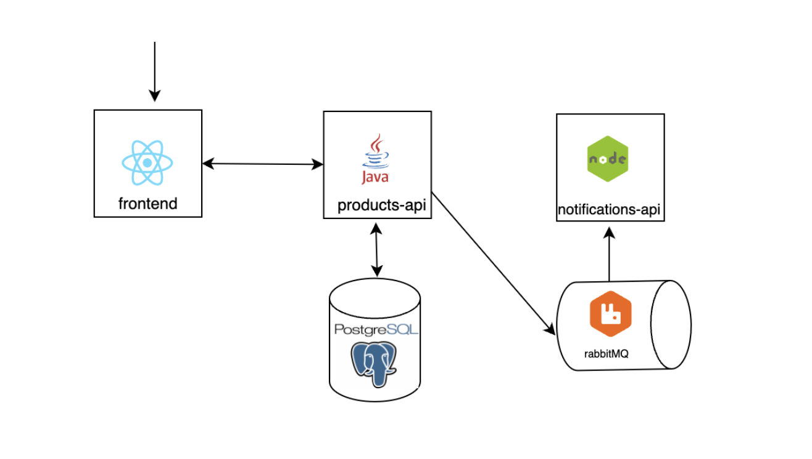

**Zadanie zaliczeniowe**
===
W ramach kursu samodzielnie przygotujesz projekt zaliczeniowy - aplikację **store-app** - którego pierwsza część polegać
będzie na konteneryzacji, a druga na orkiestracji komponentów sklepu internetowego:
* ``store-frontend`` (**React**) - aplikacja webowa, komunikująca się z backendem ``products-api``, nasłuchująca na porcie **3000**
* ``products-api`` (**Java**) - API restowe dla produktów i zamówień, nasłuchujące na porcie **8080**
* ``notifications-api`` (**JavaScirpt**) - wysyłanie powiadomień dla klientów o statusie realizacji zamówienia, nasłuchujące na porcie **5001**
* baza danych (**MySQL**) - przechowywanie danych na temat produktów i zamówień
* system kolejkowy (**RabbitMQ**) - do komunikacji ``products-api`` z ``notifications-api``

_Uwaga_: Pamiętaj, że pod adresem https://hub.docker.com/ znajdziesz informacje dotyczące tego, w jaki sposób zkonteneryzowac
bazę danych i system kolejkowy.

Frontend ``store-frontend`` komunikuje się z ``products-api``, aby wyświetlac produkty dostępne w sklepie oraz móc składac zamówienia.
Products API pozwala na:
* otrzymanie listy dostępnych produktów
* dodanie produktu
* usunięcie produktu
* utworzenie zamówienia
* otrzymanie listy zamówień
* zmiana statusu zamówienia
* usunięcie zamówienia

Jeśli zamowienie zmienia status, wówczas zostaje wysłana z ``products-api wiadomośc`` na kolejkę **RabbitMQ**. ``Notifications-api`` pobiera
wiadomości z kolejki i wysyła powiadomienia do użytkownika o zmianie statusu zamówienia (zaimplementowane jest
jedynie wyświetlanie komunikatu w konsoli, np. _Sending SMS to phone number 111222333: Order with id=3 has new status PROCESSING._ Z bazą danych komunikuje się tylko backend ``products-api``.

#### Zmienne środowiskowe:
Kod zawiera wszystko skonfigurowane tak, aby zadziałało dopiero po zdefiniowaniu zmiennych środowiskowych:
* **RabbitMQ**:
  * ``RABBITMQ_HOST``
  * ``RABBITMQ_PORT``
  * ``RABBITMQ_QUEUE_NAME``
* **MySQL**:
  * ``MYSQL_HOST``
  * ``MYSQL_PORT``
  * ``MYSQL_USERNAME``
  * ``MYSQL_PASSWORD``
  * ``MYSQL_DATABASE``

### Opis (przykłady) użytych obiektów:
**Product**
```
{
  id: 2,
  name: "Mleko 1L",
  image: "https://obrazki/mleko.png",
  price: 4.99,
  description: "Dobre mleko 1L"
}
```

**Status**\
(enum): ```DELIVERED, NEW, PROCESSING, SENT```

**Order**
```
{
  id: 1,
  status: "SENT",
  productId: 2,
  phone: "111222333",
  address: "My address"
}
```

### Częśc 1
Przygotuj pliki ``Dockerfile`` dla każdego z trzech komponentów, zbuduj obrazy i umieść w swoim repozytorium DockerHub,
a następnie przygotuj plik ``docker-compose.yaml`` dla całej aplikacji (włącznie z bazą danych i kolejką).

#### Schemat rozwiązania dla Dockera:


### Częśc 2
Druga częś zadania polega na orkiestracji Kubernetesem całej aplikacji, przy uwzględnieniu następujących założeń:
* liczba replik store-fronten - 3
* liczba replik products-api - 2
* liczba replik notifications-api - 2
* liczba replik bazy danych - 1
* liczba replik systemu kolejkowego - 1

Gotowe rozwiązanie, zawierające pliki Dockerfile (pamiętaj o plikach _.dockerignore_) z pierwszej części zadania oraz katalog ``k8s`` z plikami manifestu Kubernetesa umieść w repozytorium GitHub, a link prześlij do mentora.

#### Schemat rozwiązania dla Kubernetes:
